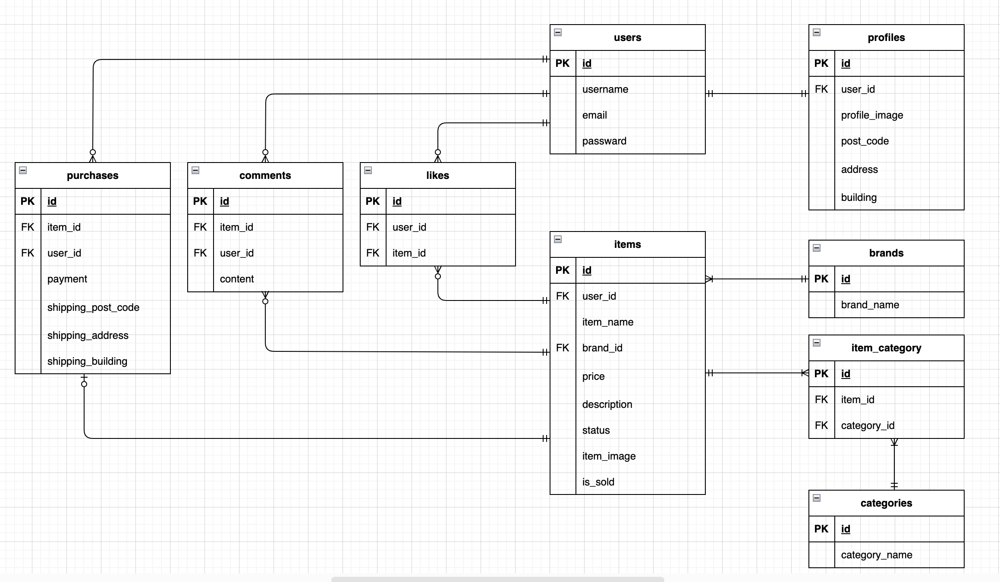

# flea-market-application(模擬案件１)

## アプリ概要
ユーザーが商品の出品・購入を行えるアプリケーションです。
ログイン機能、商品出品、コメント・いいね機能、購入処理などを実装しています。

## 環境構築

### Dockerビルド

1.`git clone git@github.com:yui-0509/flea-market-application.git` 

2.docker-compose.ymlのmysqlに`platform:linux/x86_64`を追加

3.DockerDesktopアプリを立ち上げる

4.`docker-compose up -d --build` 

### Laravel環境構築

1.`docker-compose exec php bash` 

2.`composer install` 

3..env.exampleファイルを基に.envファイルを作成し、下記環境変数を変更 

```bash
cp .env.example .env
```

```env
DB_CONNECTION=mysql
DB_HOST=mysql
DB_PORT=3306
DB_DATABASE=laravel_db
DB_USERNAME=laravel_user
DB_PASSWORD=laravel_pass
```

4.アプリケーションキーの作成 

   `php artisan key:generate` 

5.マイグレーションの実行 

   `php artisan migrate` 

6.シーディングの実行. 

   `php artisan db:seed` を実行することで、以下のダミーデータが登録されます。

- 商品（10件）
- ブランド名（２件）
- カテゴリ（14種）

7.商品の状態と支払い方法は、モデル内の定数で管理

- 商品の状態（Item::STATUS_LIST）
```php
public const STATUS_LIST = [
   1 => '良好',
   2 => '目立った傷や汚れなし',
   3 => 'やや傷や汚れあり',
   4 => '状態が悪い',
];
```

- 支払い方法（Purchase::PAYMENT_METHODS）
```php
const PAYMENT_METHODS = [
   'convenience' => 'コンビニ払い',
   'card' => 'カード払い',
];
```
## メール送信確認(Mailhog)
ローカル環境でメール送信を確認するために[Mailhog](https://github.com/mailhog/MailHog) を使用しています。

1.docker-compose.ymlにMailhogのサービスを追加（未設定の場合）

`docker-compose.yml`のservices:`ブロックの中に以下を追加してください。

```yaml
mailhog:
  image: mailhog/mailhog
  ports:
    - "8025:8025"
```

2.Mailhogの起動
以下のコマンドでMailhogを起動できます。

`docker-compose up -d`

3.MailhogのUI確認
ブラウザで下記にアクセスすると、送信されたメールを確認できます。

http://localhost:8025

4..env設定

```env
MAIL_MAILER=smtp
MAIL_HOST=mailhog
MAIL_PORT=1025
MAIL_USERNAME=null
MAIL_PASSWORD=null
MAIL_ENCRYPTION=null
MAIL_FROM_ADDRESS=no-reply@example.com
MAIL_FROM_NAME=flea-market-application
```

### 使用技術（実行環境）

- php 8.1.x
- Laravel　8.83.29
- MySQL 8.0.26
- nginx 1.21.1
- フロントエンド　Blade,CSS,JavaScript
- 開発環境　Docker
- 認証　Laravel Fortify
- 言語　PHP

### ER図

 

### URL

- 開発環境：http://localhost/
- ユーザー登録：http://localhost/register
- phpMyAdmin：http://localhost:8080/
