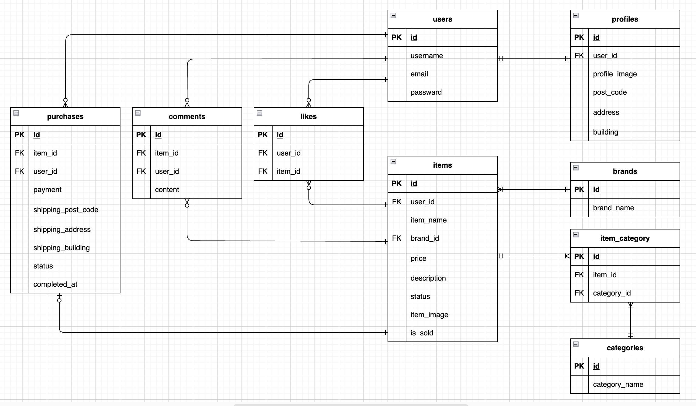
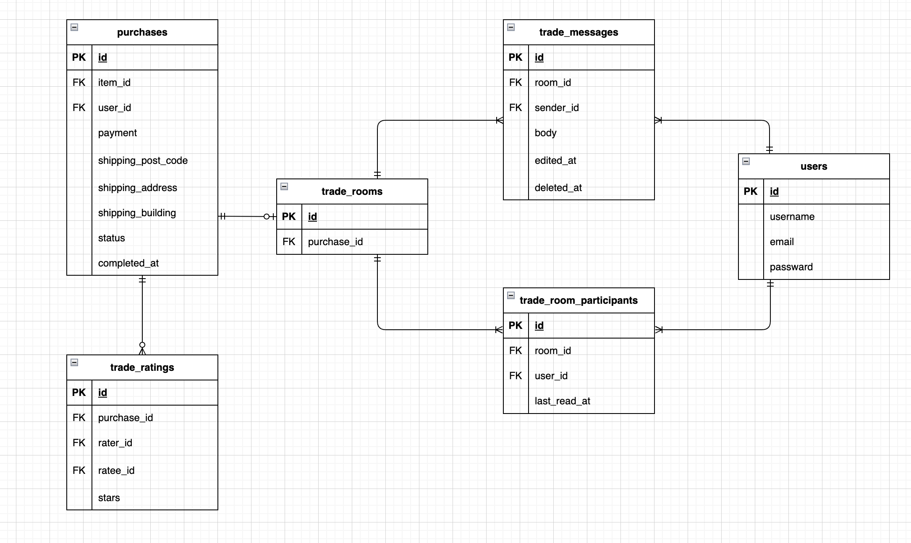

# flea-market-application(模擬案件１・Pro入会テスト)

## アプリ概要
ユーザーが商品の出品・購入を行えるアプリケーションです。
ログイン機能、商品出品、コメント・いいね機能、購入処理などを実装しています。
また、取引チャット機能を導入し、取引完了ボタンやユーザー評価機能を実装することで、より安全にお取引いただけるようにしています。

## 環境構築

### Dockerビルド

1.`git clone git@github.com:yui-0509/flea-market-application.git` 

2.docker-compose.ymlのmysqlに`platform:linux/x86_64`を追加

3.DockerDesktopアプリを立ち上げる

4.`docker-compose up -d --build` 

### Laravel環境構築

1.`docker-compose exec php bash` 

2.`composer install` 

3..env.exampleファイルを基に.envファイルを作成し、下記環境変数を変更 

```bash
cp .env.example .env
```

```env
DB_CONNECTION=mysql
DB_HOST=mysql
DB_PORT=3306
DB_DATABASE=laravel_db
DB_USERNAME=laravel_user
DB_PASSWORD=laravel_pass
```

4.アプリケーションキーの作成 

   `php artisan key:generate` 

5.マイグレーションの実行 

   `php artisan migrate` 

6.シーディングの実行. 

   `php artisan db:seed` を実行することで、以下のダミーデータが登録されます。

- 商品（10件）</br>
  ①腕時計(¥15,000)</br>
  ②HDD(¥5,000)</br>
  ③玉ねぎ3束(¥300)</br>
  ④革靴(¥4,000)</br>
  ⑤ノートPC(¥45,000)</br>
  ⑥マイク(¥8,000)</br>
  ⑦ショルダーバッグ(¥3,500)</br>
  ⑧タンブラー(¥500)</br>
  ⑨コーヒーミル(¥4,000)</br>
  ⑩メイクセット(¥2,500)</br>
- ブランド名（２件）
- カテゴリ（14種）
- 一般ユーザー（３名）</br>
  name:一般ユーザー1</br>
  email:user1@test.com</br>
  商品①〜⑤を出品</br>
  name:一般ユーザー2</br>
  email:user2@test.com</br>
  商品⑥〜⑩を出品</br>
  name:一般ユーザー3</br>
  email:user3@test.com</br>
  ※パスワードは全員共通で`password123`です。

7.商品の状態と支払い方法は、モデル内の定数で管理

- 商品の状態（Item::STATUS_LIST）
```php
public const STATUS_LIST = [
   1 => '良好',
   2 => '目立った傷や汚れなし',
   3 => 'やや傷や汚れあり',
   4 => '状態が悪い',
];
```

- 支払い方法（Purchase::PAYMENT_METHODS）
```php
const PAYMENT_METHODS = [
   'convenience' => 'コンビニ払い',
   'card' => 'カード払い',
];
```
### メール送信確認(Mailtrap)
ローカル環境でメール送信を確認するためにMailtrapを使用しています。

.env設定
```env
MAIL_MAILER=smtp
MAIL_HOST=sandbox.smtp.mailtrap.io
MAIL_PORT=2525
MAIL_USERNAME=（MailtrapのUsername）
MAIL_PASSWORD=（MailtrapのPassword）
MAIL_ENCRYPTION=tls
MAIL_FROM_ADDRESS=no-reply@example.com
MAIL_FROM_NAME="${APP_NAME}"
```

商品購入者が「取引完了ボタン」を押下すると、商品出品者宛に通知メールが送信されます。
Mailtrapを使用することで、実際にメール送信を行わず、テスト用メールボックス上で通知メールの内容を確認できます。

### 使用技術（実行環境）

- php 8.1.
- Laravel　8.75
- MySQL 8.0.26
- nginx 1.21.1
- フロントエンド　Blade,CSS,JavaScript
- 開発環境　Docker
- 認証　Laravel Fortify
- 言語　PHP

### ER図
- 全体構成</br>
 
- チャット・評価機能（追加分）</br>
  

### URL

- 開発環境：http://localhost/
- ユーザー登録：http://localhost/register
- phpMyAdmin：http://localhost:8080/
