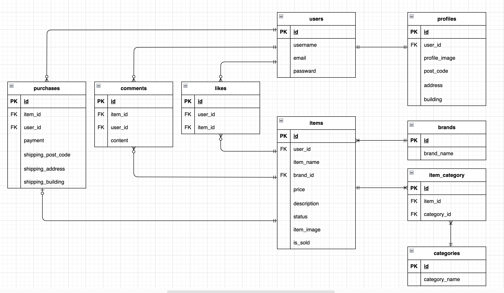

# frea-market-application(模擬案件１)

## 環境構築

### Dockerビルド

1.`git clone git@github.com:yui-0509/flea-market-application.git` 

2.docker-compose.ymlのmysqlに`platform:linux/x86_64`を追加

3.DockerDesktopアプリを立ち上げる

4.`docker-compose up -d --build` 

### Laravel環境構築

1.`docker-compose exec php bash` 

2.`composer install` 

3..env.exampleファイルを基に.envファイルを作成し、下記環境変数を変更 

```jsx
DB_CONNECTION=mysql
DB_HOST=mysql
DB_PORT=3306
DB_DATABASE=laravel_db
DB_USERNAME=laravel_user
DB_PASSWORD=laravel_pass
```

4.アプリケーションキーの作成 

   `php artisan key:generate` 

5.マイグレーションの実行 

   `php artisan migrate` 

6.シーディングの実行. 

   `php artisan db:seed` 

### 使用技術（実行環境）

- php 8.1.x
- Laravel　8.83.29
- MySQL 8.0.26

### ER図

 

### URL

- 開発環境：http://localhost/
- phpMyAdmin：http://localhost:8080/
